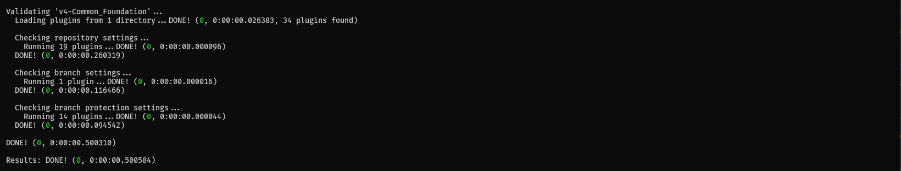
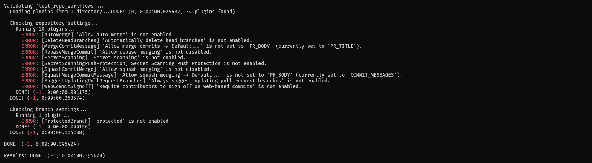
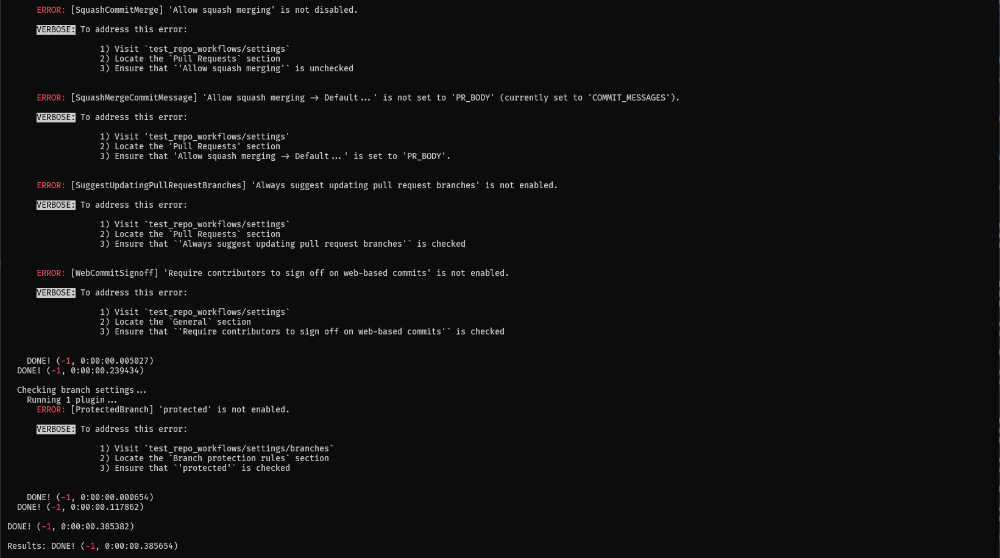
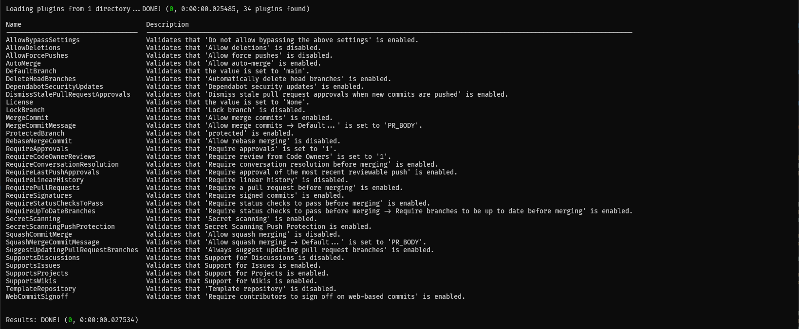
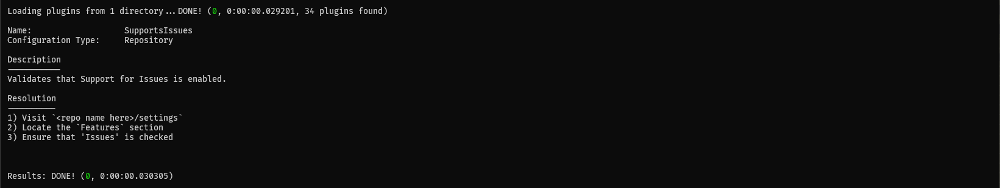
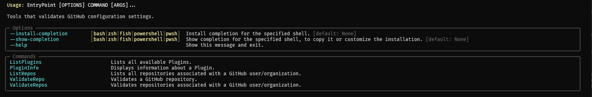

# GitHubConfigurationValidator

Command line tool that validates configuration settings for one or more GitHub repositories. Validation plugins can be used to customize the rules enforced by the tool.

## Features

- Configuration verification handled through a [plugin architecture](https://github.com/davidbrownell/DavidBrownell_GitHubConfigurationValidator/blob/main/src/GitHubConfigurationValidator/src/GitHubConfigurationValidatorLib/Plugin.py)
    - A number of plugins are available [out-of-the box](https://github.com/davidbrownell/DavidBrownell_GitHubConfigurationValidator/tree/main/src/GitHubConfigurationValidator/src/Plugins)
    - Custom plugins can be written and included via the `--plugin-dir` command line argument.
- Works with GitHub users (https://github.com) and GitHub organizations (via the `--github-url` command line argument).
- All plugins can be customized on the command line to alter validation behavior.
- Plugins include steps to resolve errors.

See the [screen shots](#screen-shots) below for more information.

## Quick Start

There are a number of different ways to use this tool:

### A) Docker Container

#### Without a GitHub Personal Access Token (PAT)

1) `docker run -it --rm dbrownell/github_configuration_validator:latest <arguments here>`

#### With a GitHub Personal Access Token (PAT) stored within a file on the host

1) `docker run -it --rm -v "<directory containing PAT file>:/local" dbrownell/github_configuration_validator:latest <arguments here> --pat /local/<name of PAT file>`

### B) Binary

1) Download a released archive [here](https://github.com/davidbrownell/DavidBrownell_GitHubConfigurationValidator/releases).
2) Extract the archive.
2) Run the extracted binary from a terminal.

### C) Source Code (to use the tool)

1) Enlist in this repository.
2) Run `Bootstrap.sh`
3) From a terminal, run one of the following os-specific commands to activate an environment:

Linux/MacOS:    `. ./Activate.sh standard`
Windows:        `Activate.cmd standard`

4) From the same terminal, run one of the following os-specific commands to run the tool:

Linux/MacOS:    `GitHubConfigurationValidator.sh <arguments here>`
Windows:        `GitHubConfigurationValidator.cmd <arguments here>`

### D) Source Code (to develop the tool)

1) Enlist in this repository.
2) Run `Bootstrap.sh`
3) From a terminal, run one of the following os-specific commands to activate an environment:

Linux/MacOS:    `. ./Activate.sh dev`
Windows:        `Activate.cmd dev`

4) From the same terminal, run one of the following os-specific commands to run the tool:

Linux/MacOS:    `GitHubConfigurationValidator.sh <arguments here>`
Windows:        `GitHubConfigurationValidator.cmd <arguments here>`

## Screen Shots

### No Validation Errors

`GitHubConfigurationValidator.sh ValidateRepo <GitHub username> <GitHub repository name>`

### Validation Errors

`GitHubConfigurationValidator.sh ValidateRepo <GitHub username> <GitHub repository name>`

### Verbose Validation Errors

`GitHubConfigurationValidator.sh ValidateRepo <GitHub username> <GitHub repository name> --verbose`

### List Plugins

`GitHubConfigurationValidator.sh ListPlugins`

### Plugin Information

`GitHubConfigurationValidator.sh PluginInfo SupportsIssues`

### Entry Points

`GitHubConfigurationValidator.sh`

